<br/>
<br/>

```
001 — ABOUT
─────────────────────────────────────────────
Frontend developer.
I build interfaces with TypeScript & Next.js —
fast, clean, and with attention to detail.

→ currently: exploring AI-powered interfaces
→ open to:   interesting projects & collabs
```


<br/>
<br/>

<p>
  <picture>
    
  </picture>
  <picture>
    
  </picture>
</p>

```
003 — SELECTED WORK
─────────────────────────────────────────────
```

<p>
  <a href="https://github.com/cxcrowx/nextjs-ai-chatbot">
    
  </a>
  <a href="https://github.com/cxcrowx/PseGlavius">
    
  </a>
</p>


