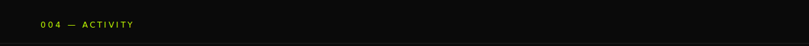

<br/>
<br/>

```
001 — ABOUT
─────────────────────────────────────────────
Frontend developer.
I build interfaces with TypeScript & Next.js —
fast, clean, and with attention to detail.

→ currently: exploring AI-powered interfaces
→ open to:   interesting projects & collabs
```


<br/>
<br/>


<br/>
<br/>
<a href="https://github.com/cxcrowx">
  
</a>

```
003 — SELECTED WORK
─────────────────────────────────────────────
```

<p>
  
  
</p>


